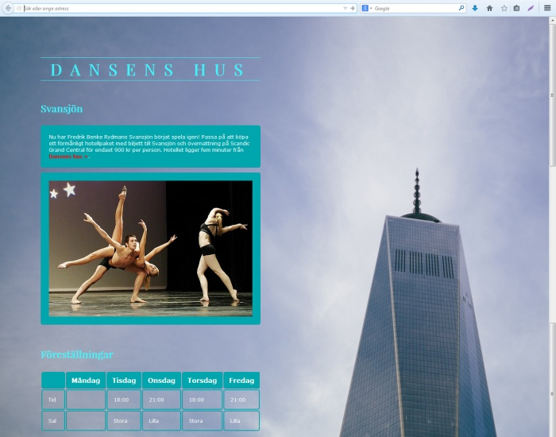
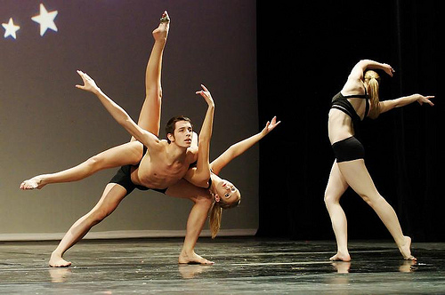

# Prov 1b

## Inspelning av hela provet krävs för godkänt prov
1. Starta inspelningen i **OBS Studio**
1. Arbeta med uppgiften
1. När du är klar **commit & sync**
1. Stoppa inspelningen i **OBS Studio** och lämna in videon på **Classroom**

## Provet


### Uppgift
- Skapa en sida som ser ut som skärmdumpen ovan.
- Sidan har ett avstånd på 100px till toppkanten och 100px till vänsterkanten.
- Använd typsnittet **"Playfair Display"** från Google Fonts: 
```css
@import url('https://fonts.googleapis.com/css2?family=Playfair+Display:ital,wght@0,400..900;1,400..900&display=swap');
font-family: "Playfair Display", serif;
```
- Bilden på dansarna ska ha en blå ram.
- Länka "Dansens hus" till den riktiga webbplatsen enligt skärmdumpen: https://dansenshus.se
- Formatera all övrig text till "Verdana".
- Infoga en tabell enligt skärmdumpen.
- Kommentera din kod.
- Indentera din kod så att den är tydlig att följa.

### Kvalité
* Kommentera din kod.
* Indentera din kod så den är tydlig att följa.

### Dokumentation
Du får titta på följande sidor:
* [HTML](https://www.w3schools.com/html)
* [CSS](https://www.w3schools.com/css/default.asp)
* [Javascript](https://www.w3schools.com/js/default.asp)

## Material som används

### Text som används
> "Nu har Fredrik Benke Rydmans Svansjön börjat spela igen! Passa på att köpa ett förmånligt hotellpaket med biljett till Svansjön och övernattning på Scandic Grand Central för endast 900 kr per person. Hotellet ligger fem minuter från Dansens hus."

### Färger som används

* <code style="background:#38f7ff; color:#000">#38f7ff</code>
* <code style="background:#00a6ad; color:#000">#00a6ad</code>

### Bilder som används
Ladda ned alla bilder: 




## Arbetsgång i webb


